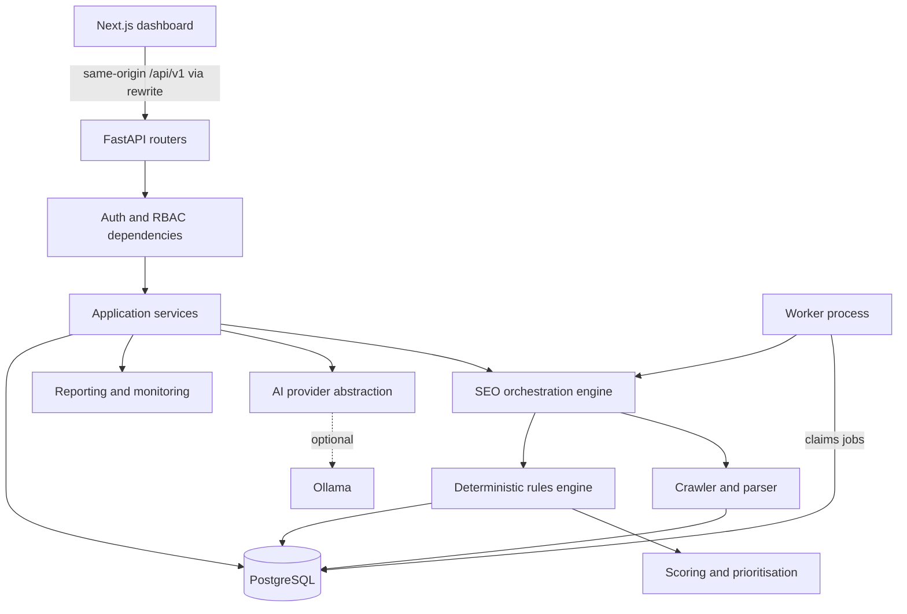

# Architecture

NIIT AI SEO Agent is a self-hosted SEO management platform. It crawls websites, runs a
deterministic rules engine, scores and prioritises findings, and uses AI only as an
optional layer for explanations and drafts. NASTP Institute of Information Technology
(NIIT) is the first tenant. The design supports multi-tenant SaaS without a rewrite.

## 1. Guiding decisions

| Decision | Choice | Why |
|----------|--------|-----|
| Deployment shape | Modular monolith: one FastAPI app, one worker process, one Next.js app, one PostgreSQL database | Simple to run and reason about. Module boundaries allow later extraction. |
| Source of truth | Deterministic crawler and rules engine | Findings must be reproducible, testable and evidence-backed. |
| AI role | Enhancement layer behind a provider interface | Core features must work when Ollama is offline. |
| Tenancy | Shared database, `organisation_id` on every tenant-owned row, enforced in the service layer | Cheapest model that still gives strict isolation. Row-level security can be added later. |
| Background jobs | Database-backed queue using `SELECT ... FOR UPDATE SKIP LOCKED` | No Redis needed for Phase 1 to 5. Replaceable later. |
| API style | Versioned REST under `/api/v1`, Pydantic v2 schemas, OpenAPI | Typed contract for the frontend and future integrations. |

## 2. Logical layers



Each layer depends only on layers below it. Routers never touch the database directly;
they call services. Services receive an authorised context and an `AsyncSession`.

## 3. Repository layout

```
backend/
  app/
    core/            config, logging, database, security, errors, pagination
    modules/
      auth/          login, refresh, logout, token handling
      users/         user model and profile
      organisations/ organisations, members, roles, permissions
      projects/      projects and project settings
      audit_logs/    append-only audit trail
      crawler/       (Phase 2) fetcher, URL safety, robots, sitemaps, parser
      seo_rules/     (Phase 3) rule registry and rule implementations
      seo_scoring/   (Phase 3) scoring and prioritisation
      ai/            (Phase 4) provider interface, Ollama provider, agent tools
      reporting/     (Phase 5) HTML and PDF reports, comparisons
    providers/       abstract provider interfaces (AIProvider, KeywordProvider, ...)
    api/             router aggregation under /api/v1
    cli.py           admin bootstrap and seed commands
    main.py          application factory
  alembic/           migrations
  tests/             unit, integration and security tests
frontend/
  src/app/           Next.js App Router routes (thin server pages)
  src/components/views/  client views, one per page
  src/components/    shadcn/ui components and layout
  src/lib/           API client, auth session, query hooks, schemas
  e2e/               Playwright end-to-end tests
docs/                architecture, plan, security, NIIT configuration
docker-compose.yml   PostgreSQL and optional Ollama for local development
```

Each backend module owns `models.py`, `schemas.py`, `service.py` and `router.py`.
Modules may import from `core` and from modules earlier in this dependency order:

```
core -> users -> organisations -> projects -> audit_logs
     -> crawler -> seo_rules -> seo_scoring -> ai -> reporting
```

## 4. Tenancy and authorisation

Hierarchy: Platform, Organisation, Members, Projects, Crawls, Pages, Issues,
Recommendations, Reports.

- Every tenant-owned table carries `organisation_id` with a foreign key and index,
  even when it could be derived through `project_id`. This makes isolation checks
  cheap and auditable.
- Platform Administrator is a flag on `users`. All other roles are per organisation,
  stored on `organisation_members.role`.
- Roles, most to least privileged: `owner`, `admin`, `seo_manager`, `editor`, `viewer`.
- Permissions are declared once in `organisations/permissions.py` as a map from
  permission to allowed roles. Routers declare the permission they need; a shared
  dependency resolves the organisation from the path (directly, or via the project),
  loads the caller's membership and checks it.
- A resource in an organisation the caller does not belong to returns `404`, not
  `403`, so IDs cannot be used to probe for existence.
- Platform administrators can manage organisations and memberships but have no implicit
  access to projects or SEO data. To support a tenant they add themselves as a member,
  which is audit-logged.

## 5. Authentication

- Passwords hashed with Argon2id (`argon2-cffi`).
- Access token: JWT (HS256), 15 minutes, returned in the response body, held in
  memory by the frontend.
- Refresh token: random 256-bit value, stored only as a SHA-256 hash in
  `refresh_tokens`, sent as an `HttpOnly`, `SameSite=Strict` cookie (and `Secure`
  outside local development) scoped to `/api/v1/auth`. Rotated on every use. Reuse of
  a revoked token revokes the whole token family.
- The Next.js server proxies `/api/v1/*` to FastAPI, so the browser sees a single
  origin and cookies stay first-party.
- Login is rate limited per email and, with a higher threshold, per client address.
  Phase 1 uses an in-process limiter; multi-instance deployments need a shared store.
  See `docs/SECURITY.md` for how client addresses are determined behind proxies.

## 6. Data model

UUID primary keys, `created_at`/`updated_at` timestamps, foreign keys with explicit
`ON DELETE` behaviour, and indexes on every foreign key and common filter.

| Entity | Phase | Notes |
|--------|-------|-------|
| users | 1 | Email unique (case-insensitive), Argon2 hash, platform-admin flag, active flag |
| refresh_tokens | 1 | Hashed token, family ID, expiry, revoked flag |
| organisations | 1 | Name, slug, domain, time zone, language, settings JSON |
| organisation_members | 1 | Unique (organisation, user), role |
| projects | 1 | Organisation, name, root URL, normalised domain, soft delete |
| project_settings | 1 | One-to-one with project; crawl limits, excluded paths, page groups, content types, institutional profile |
| audit_logs | 1 | Append-only; actor, organisation, action, target, metadata, IP |
| crawl_jobs | 2 | Status, config snapshot, counters, error, timings; also the job queue |
| crawl_pages | 2 | URL, status, timings, redirect chain, extracted SEO fields, content hash |
| crawl_links | 2 | Source page, target URL, anchor, internal flag, nofollow |
| schema_findings | 3 | Structured data blocks, types, validity |
| seo_issues | 3 | Fields listed in section 8 of the product brief |
| seo_scores | 3 | Per crawl, per category, with rule contributions |
| internal_link_recommendations | 3 | Source, target, reason, evidence |
| ai_analyses | 4 | Provider, model, prompt hash, validated output, status |
| seo_recommendations | 4 | Grounded recommendation linked to issues |
| content_drafts | 4 | Original, proposed, reason, evidence, version |
| approvals | 4 | Status transitions with reviewer and timestamps |
| reports | 5 | Crawl, format, storage path, generated by |
| integrations | 6 | Provider type, encrypted config, enabled flag |

Entities are introduced in the phase that first uses them, each with its own
migration. This keeps every migration small and tested against real code.

Structured configuration (organisation settings, project settings) is stored as
`JSONB` but always read and written through Pydantic models, so the database never
holds unvalidated configuration.

## 7. Crawler design (Phase 2)

- `url_safety`: scheme allowlist (`http`, `https`), IDNA normalisation, port
  allowlist, DNS resolution of every hop, rejection of loopback, private, link-local,
  multicast, reserved, CGNAT and cloud-metadata addresses. The resolved IP is pinned
  for the actual connection so DNS rebinding between check and connect is not
  possible. Redirects are followed manually and revalidated each hop.
- Scope: same host as the project by default; other hosts only if listed in project
  settings by an authorised user.
- Politeness: robots.txt honoured for the configured user agent, per-host delay,
  bounded concurrency, request timeout, response size cap, content-type filter.
- Frontier: breadth-first with depth tracking, deduplication on normalised URL,
  seeded from the root URL and sitemaps.
- Parsing with `selectolax` for HTML and `lxml` for sitemaps. Playwright rendering is
  opt-in per project.
- Progress counters are written to `crawl_jobs` so the UI can poll. Cancellation is
  a status flag checked between fetches.

## 8. Rules engine and scoring (Phase 3)

- A rule is a small class with `id`, `category`, `default_severity` and
  `evaluate(context) -> list[Finding]`. Rules are pure functions of crawl data, so
  they are unit-tested with fixtures.
- Every finding carries evidence: the URL, the observed value and the threshold.
- Category score = `100 x (1 - min(1, sum(weight(severity) x affected_share)))`,
  where `affected_share` is affected pages over pages analysed. Weights and category
  percentages (technical 30, on-page 30, content 20, internal linking 10, structured
  data 10) are configurable per project. The score is a health indicator for this
  site only. It is not a Google ranking factor or a prediction of search results.
- Priority score combines severity, affected pages, page importance (from configured
  important pages and page groups), confidence and effort. The UI shows the breakdown.
- An issue is marked resolved only when a later crawl covers the same URL and the
  rule no longer fires.

## 9. AI layer (Phase 4)

- `AIProvider` interface: `health()`, `generate_structured(prompt, schema)`.
- `OllamaProvider` is the first implementation. A `NullProvider` reports
  "unavailable" so callers degrade cleanly.
- The agent calls a fixed set of typed internal tools (for example `get_seo_issues`,
  `get_page_details`, `compare_crawls`). Tools read through the same authorised
  services as the API. There is no SQL, shell or free network access.
- Outputs are validated against Pydantic schemas. Invalid output is retried once
  with the validation error, then stored as failed.
- Prompts include only project evidence and approved sources, and instruct the
  model to state when data is unavailable.

## 10. Provider interfaces

Defined in `backend/app/providers/` as `typing.Protocol` classes:
`AIProvider`, `KeywordProvider`, `SERPProvider`, `RankingProvider`,
`SearchConsoleProvider`, `AnalyticsProvider`, `CMSProvider`, `NotificationProvider`,
`CrawlerProvider`, `SEOAnalysisProvider`, `ReportProvider`.

Initial implementations: `OllamaProvider`, `LocalCrawlerProvider`,
`RuleBasedSEOProvider`, `LocalReportProvider`. Paid providers are not implemented.

## 11. Observability and errors

- JSON structured logs with a per-request `request_id`, also returned as the
  `X-Request-ID` header.
- Consistent error body: `{"error": {"code", "message", "details"}, "request_id"}`.
  Unhandled exceptions return a generic 500 with the request ID; stack traces go to
  logs only.
- `/api/v1/health` reports database status and AI provider status separately.

## 12. Frontend

- Next.js App Router, TypeScript strict, Tailwind CSS, shadcn/ui components,
  TanStack Query for server state, React Hook Form with Zod for forms, Recharts for
  charts.
- An authenticated layout holds the sidebar with every navigation section from the
  brief. Sections whose backend is not built yet show an honest "not available yet"
  state naming the phase. No placeholder numbers are ever rendered.
- Every data view has loading, empty, error and retry states.
