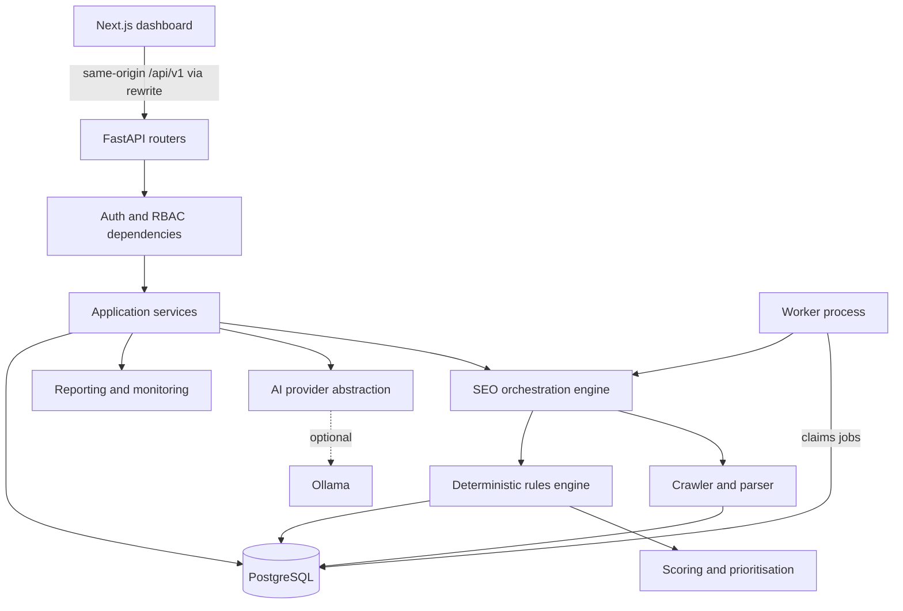

# Architecture

NIIT AI SEO Agent is a self-hosted SEO management platform. It crawls websites, runs a
deterministic rules engine, scores and prioritises findings, and uses AI only as an
optional layer for explanations and drafts. NASTP Institute of Information Technology
(NIIT) is the first tenant. The design supports multi-tenant SaaS without a rewrite.

## 1. Guiding decisions

| Decision | Choice | Why |
|----------|--------|-----|
| Deployment shape | Modular monolith: one FastAPI app, one worker process, one Next.js app, one PostgreSQL database | Simple to run and reason about. Module boundaries allow later extraction. |
| Source of truth | Deterministic crawler and rules engine | Findings must be reproducible, testable and evidence-backed. |
| AI role | Enhancement layer behind a provider interface | Core features must work when Ollama is offline. |
| Tenancy | Shared database, `organisation_id` on every tenant-owned row, enforced in the service layer | Cheapest model that still gives strict isolation. Row-level security can be added later. |
| Background jobs | Database-backed queue using `SELECT ... FOR UPDATE SKIP LOCKED` | No Redis needed for Phase 1 to 5. Replaceable later. |
| API style | Versioned REST under `/api/v1`, Pydantic v2 schemas, OpenAPI | Typed contract for the frontend and future integrations. |

## 2. Logical layers



Each layer depends only on layers below it. Routers never touch the database directly;
they call services. Services receive an authorised context and an `AsyncSession`.

## 3. Repository layout

```
backend/
  app/
    core/            config, logging, database, security, errors, pagination
    modules/
      auth/          login, refresh, logout, token handling
      users/         user model and profile
      organisations/ organisations, members, roles, permissions
      projects/      projects and project settings
      audit_logs/    append-only audit trail
      crawler/       fetcher, URL safety, robots, sitemaps, parser, engine
      seo/           rules, scoring, prioritisation, analysis, issues API
      ai/            (Phase 4) provider interface, Ollama provider, agent tools
      reporting/     (Phase 5) HTML and PDF reports, comparisons
    providers/       abstract provider interfaces (AIProvider, KeywordProvider, ...)
    api/             router aggregation under /api/v1
    cli.py           admin bootstrap and seed commands
    worker.py        background crawl worker
    main.py          application factory
  alembic/           migrations
  tests/             unit, integration and security tests
frontend/
  src/app/           Next.js App Router routes (thin server pages)
  src/components/views/  client views, one per page
  src/components/    shadcn/ui components and layout
  src/lib/           API client, auth session, query hooks, schemas
  e2e/               Playwright end-to-end tests
docs/                architecture, plan, security, NIIT configuration
docker-compose.yml   PostgreSQL and optional Ollama for local development
```

Each backend module owns `models.py`, `schemas.py`, `service.py` and `router.py`.
Modules may import from `core` and from modules earlier in this dependency order:

```
core -> users -> organisations -> projects -> audit_logs
     -> crawler -> seo_rules -> seo_scoring -> ai -> reporting
```

## 4. Tenancy and authorisation

Hierarchy: Platform, Organisation, Members, Projects, Crawls, Pages, Issues,
Recommendations, Reports.

- Every tenant-owned table carries `organisation_id` with a foreign key and index,
  even when it could be derived through `project_id`. This makes isolation checks
  cheap and auditable.
- Platform Administrator is a flag on `users`. All other roles are per organisation,
  stored on `organisation_members.role`.
- Roles, most to least privileged: `owner`, `admin`, `seo_manager`, `editor`, `viewer`.
- Permissions are declared once in `organisations/permissions.py` as a map from
  permission to allowed roles. Routers declare the permission they need; a shared
  dependency resolves the organisation from the path (directly, or via the project),
  loads the caller's membership and checks it.
- A resource in an organisation the caller does not belong to returns `404`, not
  `403`, so IDs cannot be used to probe for existence.
- Platform administrators can manage organisations and memberships but have no implicit
  access to projects or SEO data. To support a tenant they add themselves as a member,
  which is audit-logged.

## 5. Authentication

- Passwords hashed with Argon2id (`argon2-cffi`).
- Access token: JWT (HS256), 15 minutes, returned in the response body, held in
  memory by the frontend.
- Refresh token: random 256-bit value, stored only as a SHA-256 hash in
  `refresh_tokens`, sent as an `HttpOnly`, `SameSite=Strict` cookie (and `Secure`
  outside local development) scoped to `/api/v1/auth`. Rotated on every use. Reuse of
  a revoked token revokes the whole token family.
- The Next.js server proxies `/api/v1/*` to FastAPI, so the browser sees a single
  origin and cookies stay first-party.
- Login is rate limited per email and, with a higher threshold, per client address.
  Phase 1 uses an in-process limiter; multi-instance deployments need a shared store.
  See `docs/SECURITY.md` for how client addresses are determined behind proxies.

## 6. Data model

UUID primary keys, `created_at`/`updated_at` timestamps, foreign keys with explicit
`ON DELETE` behaviour, and indexes on every foreign key and common filter.

| Entity | Phase | Notes |
|--------|-------|-------|
| users | 1 | Email unique (case-insensitive), Argon2 hash, platform-admin flag, active flag |
| refresh_tokens | 1 | Hashed token, family ID, expiry, revoked flag |
| organisations | 1 | Name, slug, domain, time zone, language, settings JSON |
| organisation_members | 1 | Unique (organisation, user), role |
| projects | 1 | Organisation, name, root URL, normalised domain, soft delete |
| project_settings | 1 | One-to-one with project; crawl limits, excluded paths, page groups, content types, institutional profile |
| audit_logs | 1 | Append-only; actor, organisation, action, target, metadata, IP |
| crawl_jobs | 2 | Status, config snapshot, counters, error, timings; also the job queue |
| crawl_pages | 2 | URL, status, timings, redirect chain, extracted SEO fields, content hash |
| crawl_links | 2 | Source page, target URL, anchor, internal flag, nofollow |
| schema_findings | 3 | Per JSON-LD block or microdata set: types, validity, errors, warnings |
| seo_issues | 3 | Fields listed in section 8 of the product brief |
| seo_scores | 3 | One row per analysed crawl: overall and category scores with the rule contributions |
| internal_link_recommendations | 3 | Source, target, anchor phrase, reason, matched sentence |
| ai_analyses | 4 | Provider, model, prompt hash, validated output, status |
| seo_recommendations | 4 | Grounded recommendation linked to issues |
| content_drafts | 4 | Original, proposed, reason, evidence, version |
| approvals | 4 | Status transitions with reviewer and timestamps |
| reports | 5 | Crawl, format, storage path, generated by |
| integrations | 6 | Provider type, encrypted config, enabled flag |

Entities are introduced in the phase that first uses them, each with its own
migration. This keeps every migration small and tested against real code.

Structured configuration (organisation settings, project settings) is stored as
`JSONB` but always read and written through Pydantic models, so the database never
holds unvalidated configuration.

## 7. Crawler (Phase 2, implemented)

Code: `backend/app/modules/crawler/` and `backend/app/worker.py`.

| Part | File | Behaviour |
|------|------|-----------|
| SSRF guard | `url_safety.py` | A custom httpx network backend resolves each hostname, rejects the connection if any resolved address is not public (or explicitly allowed), and connects to the exact address it checked. Environment proxies are ignored. See `docs/SECURITY.md`. |
| Fetcher | `fetcher.py` | Follows redirects one hop at a time (each hop scope-checked and SSRF-checked, each hop waits for the per-host delay), caps body size after decompression, supports conditional requests. |
| robots.txt | `robots.py` | RFC 9309 parser with `*` and `$` wildcards, longest-match precedence, agent groups, `Crawl-delay` (capped at 30 s). 4xx means allow all; 5xx or network failure means disallow all. |
| Sitemaps | `sitemaps.py` | `urlset` and `sitemapindex`, gzip, 50 MB decompressed limit, entity resolution and network access disabled. Sitemaps are read from robots.txt `Sitemap:` lines, or `/sitemap.xml` if none are listed; only in-scope sitemaps are fetched. |
| Parser | `parser.py` | Title(s), meta description(s), meta robots, X-Robots-Tag, canonical(s), hreflang, `lang`, H1 to H6 in order, word count and SHA-256 hash of visible text, images with ALT state, links with anchor text and `nofollow`, JSON-LD (validity and `@type`s) and microdata types. |
| Engine | `engine.py` | Breadth-first frontier with depth, page and concurrency limits. Pages found only in sitemaps are crawled after link discovery; their links are recorded but not followed. A redirecting URL is stored with its chain and its in-scope destination is stored as its own page from the same response. Progress and heartbeat every second; cancellation and a maximum duration are checked there. |
| Worker | `app/worker.py` | Claims queued jobs with `FOR UPDATE SKIP LOCKED`; fails jobs whose heartbeat is older than `WORKER_STALE_AFTER_SECONDS`; fails a crawl if its results cannot be stored rather than reporting it complete. |

Finalisation resolves link targets to pages, counts distinct inbound internal links
per page, and marks orphan pages (in a sitemap, fetched, not the root, no inbound
internal links). Orphans are only marked when the crawl was not cut short by the page
limit, cancellation or the time limit, because unvisited pages could link to them.

Incremental recrawls send `If-None-Match` and `If-Modified-Since` from the previous
completed crawl. On `304 Not Modified` the page's observations and outgoing links are
copied forward, so discovery continues.

Deferred: JavaScript rendering. A headless browser makes its own sub-requests that
would bypass the connection-level SSRF guard, so it needs request interception and
its own review before it is enabled. The project setting is kept; crawls that request
it record a warning and analyse pages as served. External links are recorded but not
fetched, so broken external links are not reported.

## 8. SEO engine (Phase 3, implemented)

Code: `backend/app/modules/seo/`. No AI provider is involved anywhere in this module.

| Part | File | Behaviour |
|------|------|-----------|
| Context | `context.py` | Loads one crawl's pages, links and facts plus current project settings into memory. Rules only read this object, so they are deterministic and unit-testable. |
| Finding | `findings.py` | Pydantic model; rejects any finding without evidence or a recommendation. |
| Rules | `rules/` | 50 rules: 19 technical, 15 on-page, 7 content, 5 internal linking, 4 structured data. The catalogue is served at `GET /api/v1/seo-rules`. Thresholds come from project settings. |
| Structured data | `schema_check.py` | Checks JSON-LD for common schema.org types against documented required and recommended properties. Errors and enhancements are separate. Unknown types are not guessed at. |
| Similarity | `text.py` | 64-bit simhash over 3-word shingles; band indexing finds pairs within 3 bits without comparing every pair. |
| Link suggestions | `link_opportunities.py` | Only where a page's own text mentions another page's H1 or title phrase and does not link to it; the matched sentence is stored as evidence. |
| Scoring | `scoring.py` | Category score = 100 × (1 − min(1, Σ severity weight × share of pages affected)). Site-wide findings count as affecting every page. Overall = weighted average of the categories that could be scored. Default weights: technical 30, on-page 30, content 20, internal linking 10, structured data 10; severity weights critical 1.0, high 0.5, medium 0.2, low 0.05, informational 0. |
| Priority | `priority.py` | (severity + reach + page importance + effort bonus) × confidence, 0 to 100. Severity steps are larger than the importance bonus, so severity dominates. The breakdown is stored with each issue. |
| Orchestration | `analysis.py` | Runs everything for one completed crawl in one transaction. |

**Issue identity and lifecycle.** An issue's key is the rule plus its subject (a URL
hash, a group hash or "site"). On each analysis:

- a finding with a new key creates an open issue;
- a finding with an existing key updates it; a resolved issue reopens and its
  recurrence count increases; an ignored issue stays ignored;
- an existing issue not found again is resolved only if the crawl re-examined what it
  concerned (the page for page issues, every URL for group issues; site issues are
  always re-examined). Otherwise it stays open.

Analysis is queued when a crawl completes and run by the worker. Cancelled crawls are
never analysed, and a crawl older than one already analysed cannot be analysed,
because either would resolve issues on incomplete or stale evidence. Users can re-run
the analysis of the latest crawl, for example after changing thresholds.

The score is a site-health indicator for prioritising work. It is not a search engine
ranking factor and does not predict rankings. Ignored issues still count toward it.

## 9. AI layer (Phase 4)

- `AIProvider` interface: `health()`, `generate_structured(prompt, schema)`.
- `OllamaProvider` is the first implementation. A `NullProvider` reports
  "unavailable" so callers degrade cleanly.
- The agent calls a fixed set of typed internal tools (for example `get_seo_issues`,
  `get_page_details`, `compare_crawls`). Tools read through the same authorised
  services as the API. There is no SQL, shell or free network access.
- Outputs are validated against Pydantic schemas. Invalid output is retried once
  with the validation error, then stored as failed.
- Prompts include only project evidence and approved sources, and instruct the
  model to state when data is unavailable.

## 10. Provider interfaces

Defined in `backend/app/providers/` as `typing.Protocol` classes:
`AIProvider`, `KeywordProvider`, `SERPProvider`, `RankingProvider`,
`SearchConsoleProvider`, `AnalyticsProvider`, `CMSProvider`, `NotificationProvider`,
`CrawlerProvider`, `SEOAnalysisProvider`, `ReportProvider`.

Initial implementations: `OllamaProvider`, `LocalCrawlerProvider`,
`RuleBasedSEOProvider`, `LocalReportProvider`. Paid providers are not implemented.

## 11. Observability and errors

- JSON structured logs with a per-request `request_id`, also returned as the
  `X-Request-ID` header.
- Consistent error body: `{"error": {"code", "message", "details"}, "request_id"}`.
  Unhandled exceptions return a generic 500 with the request ID; stack traces go to
  logs only.
- `/api/v1/health` reports database status and AI provider status separately.

## 12. Frontend

- Next.js App Router, TypeScript strict, Tailwind CSS, shadcn/ui components,
  TanStack Query for server state, React Hook Form with Zod for forms, Recharts for
  charts.
- An authenticated layout holds the sidebar with every navigation section from the
  brief. Sections whose backend is not built yet show an honest "not available yet"
  state naming the phase. No placeholder numbers are ever rendered.
- Every data view has loading, empty, error and retry states.
