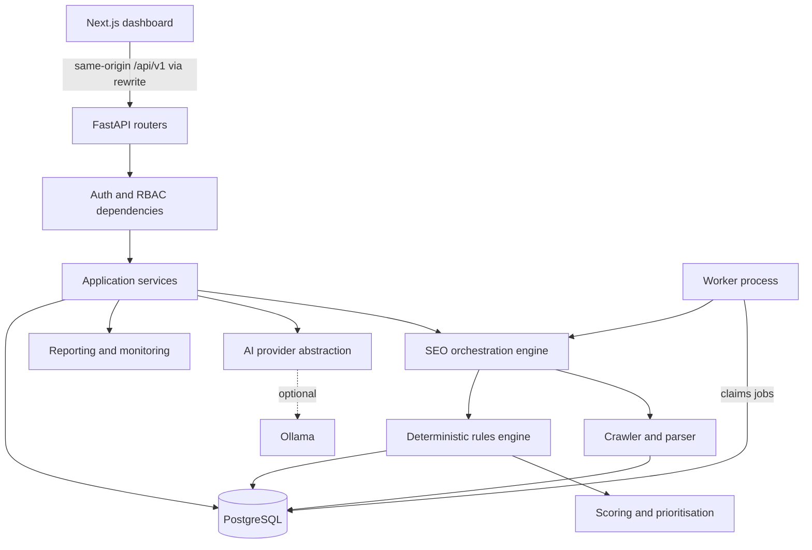

# Architecture

NIIT AI SEO Agent is a self-hosted SEO management platform. It crawls websites, runs a
deterministic rules engine, scores and prioritises findings, and uses AI only as an
optional layer for explanations and drafts. NASTP Institute of Information Technology
(NIIT) is the first tenant. The design supports multi-tenant SaaS without a rewrite.

## 1. Guiding decisions

| Decision | Choice | Why |
|----------|--------|-----|
| Deployment shape | Modular monolith: one FastAPI app, one worker process, one Next.js app, one PostgreSQL database | Simple to run and reason about. Module boundaries allow later extraction. |
| Source of truth | Deterministic crawler and rules engine | Findings must be reproducible, testable and evidence-backed. |
| AI role | Enhancement layer behind a provider interface | Core features must work when Ollama is offline. |
| Tenancy | Shared database, `organisation_id` on every tenant-owned row, enforced in the service layer | Cheapest model that still gives strict isolation. Row-level security can be added later. |
| Background jobs | Database-backed queue using `SELECT ... FOR UPDATE SKIP LOCKED` | No Redis needed for Phase 1 to 5. Replaceable later. |
| API style | Versioned REST under `/api/v1`, Pydantic v2 schemas, OpenAPI | Typed contract for the frontend and future integrations. |

## 2. Logical layers



Each layer depends only on layers below it. Routers never touch the database directly;
they call services. Services receive an authorised context and an `AsyncSession`.

## 3. Repository layout

```
backend/
  app/
    core/            config, logging, database, security, errors, pagination
    modules/
      auth/          login, refresh, logout, token handling
      users/         user model and profile
      organisations/ organisations, members, roles, permissions
      invitations/   invitations by email and their acceptance
      projects/      projects and project settings
      audit_logs/    append-only audit trail
      crawler/       fetcher, URL safety, robots, sitemaps, parser, engine
      seo/           rules, scoring, prioritisation, analysis, issues API
      ai/            provider, grounding, agent tools, AI tasks and runner
      drafts/        content drafts, versions and the approval workflow
      reports/       report builder, HTML template, PDF export
      monitoring/    crawl schedules
    providers/       abstract provider interfaces (AIProvider, KeywordProvider, ...)
    api/             router aggregation under /api/v1
    cli.py           admin bootstrap and seed commands
    worker.py        background worker: crawls, analyses, AI tasks, reports, schedules
    main.py          application factory
  alembic/           migrations
  tests/             unit, integration and security tests
frontend/
  src/app/           Next.js App Router routes (thin server pages)
  src/components/views/  client views, one per page
  src/components/    shadcn/ui components and layout
  src/lib/           API client, auth session, query hooks, schemas
  e2e/               Playwright end-to-end tests
docs/                architecture, plan, security, NIIT configuration
docker-compose.yml   PostgreSQL and optional Ollama for local development
```

Each backend module owns `models.py`, `schemas.py`, `service.py` and `router.py`.
Modules may import from `core` and from modules earlier in this dependency order:

```
core -> users -> organisations -> projects -> audit_logs
     -> crawler -> seo -> drafts -> ai -> reports, monitoring
```

## 4. Tenancy and authorisation

Hierarchy: Platform, Organisation, Members, Projects, Crawls, Pages, Issues,
Recommendations, Reports.

- Every tenant-owned table carries `organisation_id` with a foreign key and index,
  even when it could be derived through `project_id`. This makes isolation checks
  cheap and auditable.
- Platform Administrator is a flag on `users`. All other roles are per organisation,
  stored on `organisation_members.role`.
- Roles, most to least privileged: `owner`, `admin`, `seo_manager`, `editor`, `viewer`.
- Permissions are declared once in `organisations/permissions.py` as a map from
  permission to allowed roles. Routers declare the permission they need; a shared
  dependency resolves the organisation from the path (directly, or via the project),
  loads the caller's membership and checks it.
- A resource in an organisation the caller does not belong to returns `404`, not
  `403`, so IDs cannot be used to probe for existence.
- Platform administrators can manage organisations and memberships but have no implicit
  access to projects, SEO data or integrations. To support a tenant they add themselves
  as a member, which is audit-logged. Only they can attach an account that already
  exists to an organisation (see `docs/SECURITY.md`).
- `backend/tests/security/test_tenant_matrix.py` walks every route in the OpenAPI
  schema. For each one it creates the resource in one organisation and calls it as a
  member of another, expecting 404 with no data change, so a new route cannot skip the
  check unnoticed.

## 5. Authentication

- Passwords hashed with Argon2id (`argon2-cffi`).
- Access token: JWT (HS256), 15 minutes, returned in the response body, held in
  memory by the frontend.
- Refresh token: random 256-bit value, stored only as a SHA-256 hash in
  `refresh_tokens`, sent as an `HttpOnly`, `SameSite=Strict` cookie (and `Secure`
  outside local development) scoped to `/api/v1/auth`. Rotated on every use. Reuse of
  a revoked token revokes the whole token family.
- The Next.js server proxies `/api/v1/*` to FastAPI, so the browser sees a single
  origin and cookies stay first-party.
- Login is rate limited per email and, with a higher threshold, per client address.
  Phase 1 uses an in-process limiter; multi-instance deployments need a shared store.
  See `docs/SECURITY.md` for how client addresses are determined behind proxies.
- Invitations (`modules/invitations/`): an owner or admin invites an email with a role.
  A new person accepts by creating their own account and password; an existing account
  accepts by signing in as itself. Tokens are random, stored as SHA-256 hashes, single
  use, and travel in the link's fragment (`/invite#token=...`) and request bodies only.
- Password reset (`auth/`, `password_reset_tokens`): single-use links that expire after
  `PASSWORD_RESET_TTL_MINUTES`; confirming one ends every session of the account.
- Email (`core/mailer.py`) goes through the operator's own SMTP server and is optional.
  Without it, invitation links are shown to the administrator to share, and resets go
  through `app.cli reset-password`.

## 6. Data model

UUID primary keys, `created_at`/`updated_at` timestamps, foreign keys with explicit
`ON DELETE` behaviour, and indexes on every foreign key and common filter.

| Entity | Phase | Notes |
|--------|-------|-------|
| users | 1 | Email unique (case-insensitive), Argon2 hash, platform-admin flag, active flag |
| refresh_tokens | 1 | Hashed token, family ID, expiry, revoked flag |
| organisations | 1 | Name, slug, domain, time zone, language, settings JSON |
| organisation_members | 1 | Unique (organisation, user), role |
| projects | 1 | Organisation, name, root URL, normalised domain, soft delete |
| project_settings | 1 | One-to-one with project; crawl limits, excluded paths, page groups, content types, institutional profile |
| audit_logs | 1 | Append-only; actor, organisation, action, target, metadata, IP |
| crawl_jobs | 2 | Status, config snapshot, counters, error, timings; also the job queue |
| crawl_pages | 2 | URL, status, timings, redirect chain, extracted SEO fields, content hash |
| crawl_links | 2 | Source page, target URL, anchor, internal flag, nofollow |
| schema_findings | 3 | Per JSON-LD block or microdata set: types, validity, errors, warnings |
| seo_issues | 3 | Fields listed in section 8 of the product brief |
| seo_scores | 3 | One row per analysed crawl: overall and category scores with the rule contributions |
| internal_link_recommendations | 3 | Source, target, anchor phrase, reason, matched sentence |
| ai_analyses | 4 | Kind, subject, status, evidence, validated output, grounding report, provider, model, prompt version, attempts, duration; also the AI task queue |
| seo_recommendations | 4 | Grounded recommendation linked to issues and the analysis that produced it; open, accepted or dismissed |
| content_drafts | 4 | Page, field, original, proposed, reason, evidence, source (AI or person), status, version, protected flag and reasons, reviewer, source reference |
| content_draft_versions | 4 | Every proposed version with its author and reason |
| approvals | 4 | Append-only trail: action, from and to status, actor, comment, source reference |
| reports | 5 | Crawl, title, status, include-AI flag, data snapshot, rendered HTML, PDF and its status |
| crawl_schedules | 5 | One per project: enabled, frequency, hour, next and last run |
| plans | 6 | Key, name, limits (projects, members, pages per crawl, crawls a month, AI tasks a day, reports a month), default flag; `organisations.plan_id` (null means the default plan) |
| integrations | 6 | Provider, name, validated settings, Fernet-encrypted credential (deferred column) and hint, enabled flag; records only, never connected |

Entities are introduced in the phase that first uses them, each with its own
migration. This keeps every migration small and tested against real code.

Structured configuration (organisation settings, project settings) is stored as
`JSONB` but always read and written through Pydantic models, so the database never
holds unvalidated configuration.

## 7. Crawler (Phase 2, implemented)

Code: `backend/app/modules/crawler/` and `backend/app/worker.py`.

| Part | File | Behaviour |
|------|------|-----------|
| SSRF guard | `url_safety.py` | A custom httpx network backend resolves each hostname, rejects the connection if any resolved address is not public (or explicitly allowed), and connects to the exact address it checked. Environment proxies are ignored. See `docs/SECURITY.md`. |
| Fetcher | `fetcher.py` | Follows redirects one hop at a time (each hop scope-checked and SSRF-checked, each hop waits for the per-host delay), caps body size after decompression, supports conditional requests. |
| robots.txt | `robots.py` | RFC 9309 parser with `*` and `$` wildcards, longest-match precedence, agent groups, `Crawl-delay` (capped at 30 s). 4xx means allow all; 5xx or network failure means disallow all. |
| Sitemaps | `sitemaps.py` | `urlset` and `sitemapindex`, gzip, 50 MB decompressed limit, entity resolution and network access disabled. Sitemaps are read from robots.txt `Sitemap:` lines, or `/sitemap.xml` if none are listed; only in-scope sitemaps are fetched. |
| Parser | `parser.py` | Title(s), meta description(s), meta robots, X-Robots-Tag, canonical(s), hreflang, `lang`, H1 to H6 in order, word count and SHA-256 hash of visible text, images with ALT state, links with anchor text and `nofollow`, JSON-LD (validity and `@type`s) and microdata types. |
| Engine | `engine.py` | Breadth-first frontier with depth, page and concurrency limits. Pages found only in sitemaps are crawled after link discovery; their links are recorded but not followed. A redirecting URL is stored with its chain and its in-scope destination is stored as its own page from the same response. Progress and heartbeat every second; cancellation and a maximum duration are checked there. |
| Worker | `app/worker.py` | Claims queued jobs with `FOR UPDATE SKIP LOCKED`; fails jobs whose heartbeat is older than `WORKER_STALE_AFTER_SECONDS`; fails a crawl if its results cannot be stored rather than reporting it complete. |

Finalisation resolves link targets to pages, counts distinct inbound internal links
per page, and marks orphan pages (in a sitemap, fetched, not the root, no inbound
internal links). Orphans are only marked when the crawl was not cut short by the page
limit, cancellation or the time limit, because unvisited pages could link to them.

Incremental recrawls send `If-None-Match` and `If-Modified-Since` from the previous
completed crawl. On `304 Not Modified` the page's observations and outgoing links are
copied forward, so discovery continues.

Deferred: JavaScript rendering. A headless browser makes its own sub-requests that
would bypass the connection-level SSRF guard, so it needs request interception and
its own review before it is enabled. The project setting is kept; crawls that request
it record a warning and analyse pages as served. External links are recorded but not
fetched, so broken external links are not reported.

## 8. SEO engine (Phase 3, implemented)

Code: `backend/app/modules/seo/`. No AI provider is involved anywhere in this module.

| Part | File | Behaviour |
|------|------|-----------|
| Context | `context.py` | Loads one crawl's pages, links and facts plus current project settings into memory. Rules only read this object, so they are deterministic and unit-testable. |
| Finding | `findings.py` | Pydantic model; rejects any finding without evidence or a recommendation. |
| Rules | `rules/` | 50 rules: 19 technical, 15 on-page, 7 content, 5 internal linking, 4 structured data. The catalogue is served at `GET /api/v1/seo-rules`. Thresholds come from project settings. |
| Structured data | `schema_check.py` | Checks JSON-LD for common schema.org types against documented required and recommended properties. Errors and enhancements are separate. Unknown types are not guessed at. |
| Similarity | `text.py` | 64-bit simhash over 3-word shingles; band indexing finds pairs within 3 bits without comparing every pair. |
| Link suggestions | `link_opportunities.py` | Only where a page's own text mentions another page's H1 or title phrase and does not link to it; the matched sentence is stored as evidence. |
| Scoring | `scoring.py` | Category score = 100 × (1 − min(1, Σ severity weight × share of pages affected)). Site-wide findings count as affecting every page. Overall = weighted average of the categories that could be scored. Default weights: technical 30, on-page 30, content 20, internal linking 10, structured data 10; severity weights critical 1.0, high 0.5, medium 0.2, low 0.05, informational 0. |
| Priority | `priority.py` | (severity + reach + page importance + effort bonus) × confidence, 0 to 100. Severity steps are larger than the importance bonus, so severity dominates. The breakdown is stored with each issue. |
| Orchestration | `analysis.py` | Runs everything for one completed crawl in one transaction. |

**Issue identity and lifecycle.** An issue's key is the rule plus its subject (a URL
hash, a group hash or "site"). On each analysis:

- a finding with a new key creates an open issue;
- a finding with an existing key updates it; a resolved issue reopens and its
  recurrence count increases; an ignored issue stays ignored;
- an existing issue not found again is resolved only if the crawl re-examined what it
  concerned (the page for page issues, every URL for group issues; site issues are
  always re-examined). Otherwise it stays open.

Analysis is queued when a crawl completes and run by the worker. Cancelled crawls are
never analysed, and a crawl older than one already analysed cannot be analysed,
because either would resolve issues on incomplete or stale evidence. Users can re-run
the analysis of the latest crawl, for example after changing thresholds.

The score is a site-health indicator for prioritising work. It is not a search engine
ranking factor and does not predict rankings. Ignored issues still count toward it.

## 9. AI layer and approvals (Phase 4, implemented)

Code: `backend/app/modules/ai/` and `backend/app/modules/drafts/`. The AI layer reads
the results of the deterministic engine; nothing in crawling, rules, scoring or issue
tracking calls it.

| Part | File | Behaviour |
|------|------|-----------|
| Provider | `provider.py` | `AIProvider` protocol (`providers/interfaces.py`): `health()` and `chat_structured(messages, schema)`. `OllamaProvider` calls `/api/chat` with `format` set to the JSON schema, `temperature` 0 and no streaming, validates the reply with Pydantic, and retries once with the validation errors. `build_provider` is the single place new providers are added. |
| Selection | `provider.py` | `AI_PROVIDER` (environment) is a platform switch; `none` disables AI everywhere. Each organisation then chooses `ai.provider` and optionally `ai.model` in its settings; `OLLAMA_DEFAULT_MODEL` is the fallback. The Ollama address is operator configuration only; tenants cannot change it. |
| Prompts | `prompts.py` | One system prompt with the grounding rules, the organisation's brand tone and approved terminology. Every analysis stores `PROMPT_VERSION`. |
| Tools | `tools.py` | Nine typed, read-only tools (`get_project_summary`, `get_crawl_status`, `get_seo_issues`, `get_issue_evidence`, `get_page_details`, `get_internal_links`, `get_schema_findings`, `compare_crawls`, `get_rule`). Each is bound to one authorised project and filters by project and organisation. Arguments are validated; unknown tools and bad arguments return an error to the model, not an exception. |
| Tasks | `tasks.py` | Management summary, issue explanation, page improvement plan, title and description drafts, content outline. Each task gathers evidence with the tools first, then asks the model for a fixed output schema (`outputs.py`), then stores the result (recommendations or drafts). |
| Questions | `agent.py` | A bounded loop: the model may call up to 4 tools, one at a time, then must answer. After 7 steps without an answer the task fails. |
| Grounding | `grounding.py` | Every output is checked against its evidence. Violations reject the output: numbers that do not appear in the evidence, issue ids that were not supplied, and claims about guarantees, ranking positions, search volumes, traffic or backlink figures. One retry with the violations listed, then the task fails and nothing is saved. Length limits and terminology produce warnings for reviewers instead. |
| Runner | `runner.py`, `app/worker.py` | Requests are queued (`POST /projects/{id}/ai/analyses` returns 202) and the worker runs them, never the web request. Each organisation may have `AI_MAX_ACTIVE_JOBS_PER_ORG` queued or running tasks. Failures are stored with a safe message; stale running tasks are failed. |
| Comparison | `seo/compare.py` | Deterministic crawl-to-crawl comparison (score change, new, resolved and recurring issues, page changes), used by the `compare_crawls` tool and `GET /projects/{id}/compare`. |

Every `ai_analyses` row keeps the evidence, output, grounding report, provider, model,
prompt version, attempts and duration, so any AI text can be traced to its inputs. It
also keeps `metrics`: the model calls, load time, prompt and output tokens and model
time as Ollama reported them (`AIUsage`), for failed tasks too. Requests send
`keep_alive` (`AI_KEEP_ALIVE`) so the model stays loaded between tasks.

**Measuring the AI** (`evaluation.py`, CLI `ai-report` and `ai-eval`). `ai-report`
summarises an organisation's finished tasks per kind: success, model calls, median time,
prompt size, cold starts and grouped failure reasons. `ai-eval` runs a JSON test set
(`eval_cases.json` by default: summaries, issue explanations and questions, including
questions the platform has no data for) through the same `_execute` path as real tasks,
inside a transaction that is rolled back, and scores each case: completed, grounded,
cites the highest-priority issues or issues of named rules, and admits missing data.
`--model` compares models on the same cases; `--out` saves results as JSON.

**Drafts and approvals.** A draft stores the page, the field (title, meta description,
H1, content outline or section), the original content, the proposed content, the
reason and evidence. Edits create a new row in `content_draft_versions`; every action
adds a row to `approvals` and an audit log entry.

```
draft --submit--> pending_review --approve--> approved --mark published--> published --roll back--> rolled_back
                               \--reject--> rejected --edit--> draft
approved, rejected --reopen--> draft
```

- Only the states above are possible; the service rejects anything else.
- Separation of duties: the author of the current version and the person who
  submitted it cannot approve it. AI drafts have no human author, so their submitter
  is treated as the sponsor.
- Drafts that add, change or remove money amounts, percentages, dates, years, grades,
  or mention fees, eligibility, deadlines and similar topics are marked protected. They
  can only be approved with a verified source reference.
- "Published" and "rolled back" record what a person did in the CMS. The platform never
  writes to a website. CMS integration records exist (Phase 6), but connecting one needs owner authorisation.
- A person's draft must point at a page on the project's host or its subdomains.

## 10. Reports and monitoring (Phase 5, implemented)

Code: `backend/app/modules/reports/` and `backend/app/modules/monitoring/`.

| Part | File | Behaviour |
|------|------|-----------|
| Builder | `reports/builder.py` | Collects the report's facts from stored records only: scores and the previous crawl's score, crawl summary, open issues with evidence and affected URLs, link suggestions, structured data results, and the comparison with the previous crawl. The executive summary and the three-part action plan (fix first, quick wins, plan next) are written by fixed rules, so reports are complete with AI off. |
| AI section | `reports/builder.py` | Only when requested: the latest grounded management summary for this crawl and the recommendations the team accepted, labelled as AI output with the model name. |
| Template | `reports/templates/report.html.j2` | The 13 sections of the brief, in order. Jinja2 with autoescaping, because crawled text is untrusted. Inline styles, print styles for A4, organisation branding (primary colour, footer text, logo). The document's own policy forbids scripts and remote loading. |
| Logo | `reports/render.py` | Fetched once through the crawler's SSRF guard (HTTPS only, PNG, JPEG, GIF or WebP, at most 512 KB) and embedded as a data URI. |
| PDF | `reports/pdf.py` | Optional. Chromium, through Playwright, prints the stored HTML with JavaScript disabled, offline, and every request refused. Without a renderer, the report is still produced and the PDF is marked unavailable with installation steps. |
| Storage | `reports/models.py` | Each report is a snapshot (data, HTML, PDF) of the latest analysed crawl at request time. Later crawls do not change it. |
| Schedules | `monitoring/service.py` | A project's schedule (daily, weekly or monthly, at an hour in the organisation's time zone) queues a normal crawl through the same configuration and limits as a manual one. It runs only when the server switch `SCHEDULER_ENABLED` and the project's schedule are both on; both default to off. Missed runs are skipped, not replayed; a due run is skipped while a crawl is active. |

Monitoring in the dashboard uses the score history and the crawl comparison from Phase
4 (`seo/compare.py`). Issues count as resolved only when a later crawl re-examined what
they concerned.

## 10a. Commercial readiness (Phase 6, implemented)

| Part | Code | Behaviour |
|------|------|-----------|
| Plans and usage | `modules/plans/` | Plans are data. `enforce()` is called wherever usage grows (projects, members, manual and scheduled crawls, AI tasks, reports) and `pages_cap()` caps each crawl. Counts use UTC calendar months and days; report usage comes from the audit log. A per-organisation advisory lock serialises checks. The seeded `internal` plan is the default and has no limits. No payments. |
| Integrations | `modules/integrations/`, `core/crypto.py` | A provider catalogue (Search Console, Analytics, WordPress, SMTP, webhook) validates each record's settings. Credentials are encrypted with `MultiFernet`; the first key in `INTEGRATIONS_ENCRYPTION_KEYS` encrypts and all decrypt, and `app.cli rotate-secrets` re-encrypts. Records only: nothing connects to these services. |
| White-label reports | `organisations/schemas.py`, report template | A display name and cover note replace the organisation name on reports, with the existing colour, footer and logo. |
| Retention | `monitoring/retention.py` | Off by default; owner-only. Run hourly by the worker. Removes page-level data of crawls older than the newest `keep_crawls` completed crawls (marking `pages_pruned_at`) and deletes reports older than `delete_reports_after_days`. Protected: the newest completed crawl, the latest analysed crawl, crawls under analysis. |
| Platform administration | `audit_logs/router.py`, `app/cli.py` | Platform-wide audit log for platform administrators; CLI `reset-password` (ends sessions) and `rotate-secrets`. |
| Deployment | `docs/DEPLOYMENT.md` | Windows single machine and Linux with nginx, TLS and systemd. |

## 11. Provider interfaces

Defined in `backend/app/providers/` as `typing.Protocol` classes:
`AIProvider`, `KeywordProvider`, `SERPProvider`, `RankingProvider`,
`SearchConsoleProvider`, `AnalyticsProvider`, `CMSProvider`, `NotificationProvider`,
`CrawlerProvider`, `SEOAnalysisProvider`, `ReportProvider`.

Initial implementations: `OllamaProvider`, `LocalCrawlerProvider`,
`RuleBasedSEOProvider`, `LocalReportProvider`. Paid providers are not implemented.

## 12. Observability and errors

- JSON structured logs with a per-request `request_id`, also returned as the
  `X-Request-ID` header.
- Consistent error body: `{"error": {"code", "message", "details"}, "request_id"}`.
  Unhandled exceptions return a generic 500 with the request ID; stack traces go to
  logs only.
- `/api/v1/health` reports database status and platform AI status separately;
  `/api/v1/organisations/{id}/ai/status` reports whether AI is usable for one
  organisation.

## 13. Frontend

- Next.js App Router, TypeScript strict, Tailwind CSS, shadcn/ui components,
  TanStack Query for server state, React Hook Form with Zod for forms, Recharts for
  charts.
- An authenticated layout holds the sidebar with every navigation section from the
  brief; every section is a real page. No placeholder numbers are ever rendered.
- Pages are served with a Content Security Policy (see `docs/SECURITY.md`).
- Visual language: a brand gradient, an animated vector illustration on the sign-in page
  (`components/login/seo-hero-scene.tsx`), interactive tiles (`app/stat-tile.tsx`,
  `app/launch-tile.tsx`), a score ring and accessible tabs (`ui/tabs.tsx`, arrow keys,
  Home and End). Every image is a local vector, so nothing loads from other sites.
- Page thumbnails (`seo/page-thumbnail.tsx`) are drawn from each page's crawl facts:
  status, title and H1 presence, word count, internal links, noindex, orphan and alt
  text. They are not screenshots, because pages are never rendered in a browser. The
  search-result preview (`seo/serp-preview.tsx`) shows the page's own title and
  description at approximate display limits.
- Motion is decoration only. A global `prefers-reduced-motion` rule turns it off, and an
  end-to-end test checks that it does.
- AI output is always labelled "AI-generated", links the issues it cites, and shows
  why a task failed instead of partial output. When AI is off, screens say so and the
  deterministic views work unchanged. Review actions are shown only when the viewer's
  role and the draft's state allow them; the backend enforces the same rules.
- Every data view has loading, empty, error and retry states.
