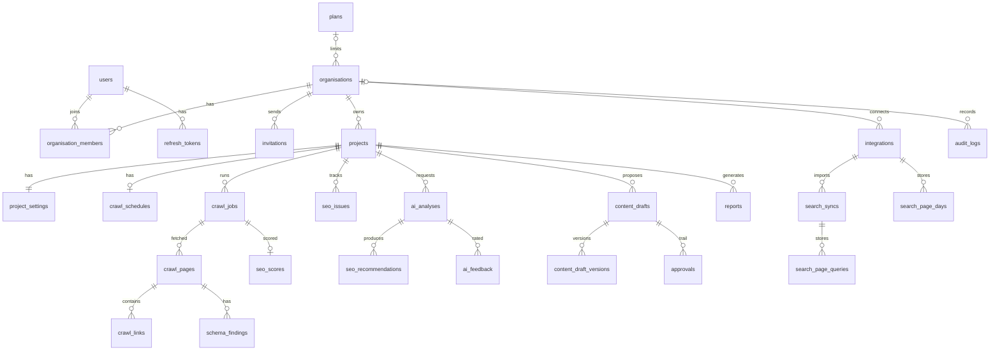

# Database

Reference for the PostgreSQL schema: conventions, tables, job queues, migrations,
retention, backups and where secrets are kept. The models in
`backend/app/modules/*/models.py` and the migrations in `backend/alembic/versions/` are
the source of truth; this document describes them. For the wider design see
`docs/ARCHITECTURE.md`, for security controls `docs/SECURITY.md`, and for operations
`docs/DEPLOYMENT.md`.

## 1. Conventions

| Topic | Convention |
|-------|------------|
| Engine | PostgreSQL 16 (`postgres:16` in `docker-compose.yml` and `deploy/compose.yaml`), accessed through async SQLAlchemy 2 with asyncpg |
| Model registry | `backend/app/models.py` imports every model so `Base.metadata` and Alembic see the whole schema |
| Primary keys | `UUIDPrimaryKey` mixin: `id UUID`, generated in Python with `uuid.uuid4`. Exception: `project_settings` uses `project_id` as its key |
| Timestamps | `Timestamps` mixin: `created_at` and `updated_at`, `timestamptz`, `server_default now()`, `updated_at` refreshed on update. Tables without the mixin declare the timestamps they need (for example append-only tables have only `created_at`) |
| Foreign keys | Always with explicit `ON DELETE`. Ownership links (`organisation_id`, `project_id`, `crawl_job_id`, parent rows) use `CASCADE`. Links to people (`*_by_id`, `actor_id`, `user_id` on feedback) and optional history links use `SET NULL` |
| JSONB | Settings, evidence, snapshots and lists are `JSONB` with `'{}'` or `'[]'` server defaults. Configuration (`organisations.settings`, `project_settings.settings`, `plans.limits`) is validated through Pydantic models before every write |
| Enums | Python `StrEnum` stored as `VARCHAR(32)` (`16` for `schedule_frequency` and `search_sync_status`) with a `CHECK` constraint: `native_enum=False, create_constraint=True`, values taken from the enum values. They are **not** PostgreSQL `ENUM` types. Several modules define the same `_enum(cls, name)` helper for this |
| Deferred columns | Large or sensitive columns load only on request: `integrations.secret`, `crawl_pages.text_content`, `reports.html`, `reports.pdf`. Code that needs them uses `undefer(...)` |
| Soft delete | Only `projects` (`deleted_at`). Everything else is deleted for real |
| Naming | Set on `Base.metadata`: `pk_<table>`, `fk_<table>_<column>_<referred table>`, `uq_<table>_<first column>`, `ix_<column label>`, `ck_<table>_<name>`. Hand-named indexes follow the same prefixes, for example `ix_crawl_jobs_status_created` and `uq_projects_org_domain_live` |

## 2. Tenancy

Every tenant-owned table carries `organisation_id` with a foreign key to
`organisations.id` (`ON DELETE CASCADE`) and an index, even where it could be derived
through `project_id` or `crawl_job_id`. Isolation is enforced in the backend, not with
row-level security:

- Routes resolve access through the shared dependencies in
  `backend/app/modules/organisations/dependencies.py`: `require_org`, `require_project`,
  `require_crawl`, `require_issue`, `require_draft`, `require_ai_analysis`,
  `require_recommendation`, `require_report` and `require_integration`.
- Each loads the resource, then the caller's `organisation_members` row for the
  resource's organisation. A missing membership, an inactive organisation or a
  soft-deleted project gives `404`, so IDs cannot be probed. A membership without the
  required permission gives `403`.
- Queries on tenant rows filter by `organisation_id` as well as the parent ID.
  `backend/tests/security/test_tenant_matrix.py` checks every route for cross-organisation
  access.

| Scope | Tables |
|-------|--------|
| Tenant (`organisation_id NOT NULL`) | `organisation_members`, `invitations`, `projects`, `project_settings`, `crawl_schedules`, `crawl_jobs`, `crawl_pages`, `crawl_links`, `seo_issues`, `seo_scores`, `schema_findings`, `internal_link_recommendations`, `ai_analyses`, `ai_feedback`, `seo_recommendations`, `content_drafts`, `content_draft_versions`, `approvals`, `reports`, `integrations`, `search_syncs`, `search_page_days`, `search_page_queries` |
| Platform | `users`, `refresh_tokens`, `password_reset_tokens`, `plans` |
| Both | `audit_logs`: `organisation_id` is nullable (`SET NULL`); platform events such as sign-ins have none |

`organisations` is the tenant itself. Platform administration is the
`users.is_platform_admin` flag; roles are per organisation on
`organisation_members.role`.

## 3. Entity reference

Columns listed are the important ones, not all of them. "Mig." is the migration that
created the table (section 6).

### Accounts and access

| Table | Mig. | Purpose and key columns | Constraints and indexes | Foreign keys |
|-------|------|-------------------------|-------------------------|--------------|
| `users` | 0001 | A person. `email VARCHAR(320)` (stored lower-cased), `full_name`, `password_hash` (Argon2id), `is_active`, `is_platform_admin`, `last_login_at` | Unique index on `email` | None |
| `refresh_tokens` | 0001 | One refresh token. `token_hash VARCHAR(64)` (SHA-256), `family_id UUID` (all rotations of one login), `expires_at`, `revoked_at`, `user_agent`, `ip_address` | Unique `token_hash`; indexes on `user_id`, `family_id` | `user_id` → users CASCADE |
| `password_reset_tokens` | 0009 | Single-use reset link. `token_hash`, `expires_at`, `used_at` | Unique `token_hash`; index on `user_id` | `user_id` → users CASCADE |
| `invitations` | 0009 | Invitation to join an organisation. `email`, `role` (`invitation_role` check), `token_hash`, `expires_at`, `accepted_at`, `revoked_at` | Unique `token_hash`; indexes on `organisation_id`, `email` | organisation CASCADE; `invited_by_id`, `accepted_by_id` → users SET NULL |

### Organisations and projects

| Table | Mig. | Purpose and key columns | Constraints and indexes | Foreign keys |
|-------|------|-------------------------|-------------------------|--------------|
| `organisations` | 0001 | Tenant. `name`, `slug VARCHAR(80)`, `domain`, `logo_url`, `timezone`, `language`, `settings JSONB` (`OrganisationSettings`), `is_active`, `plan_id` (added in 0006; null means the default plan) | Unique index on `slug`; index on `plan_id` | `plan_id` → plans SET NULL |
| `organisation_members` | 0001 | Membership. `role` (`org_role` check: `owner`, `admin`, `seo_manager`, `editor`, `viewer`) | Unique (`organisation_id`, `user_id`); indexes on both | organisation CASCADE; user CASCADE |
| `projects` | 0001 | A website. `name`, `root_url`, `domain VARCHAR(253)`, `description`, `deleted_at` (soft delete) | Partial unique `uq_projects_org_domain_live` on (`organisation_id`, `domain`) `WHERE deleted_at IS NULL` | organisation CASCADE; `created_by_id` → users SET NULL |
| `project_settings` | 0001 | One-to-one with a project. `settings JSONB` (`ProjectSettingsData`: crawl limits, page groups, institutional profile and so on) | Primary key `project_id`; index on `organisation_id` | project CASCADE; organisation CASCADE; `updated_by_id` SET NULL |

### Crawling

| Table | Mig. | Purpose and key columns | Constraints and indexes | Foreign keys |
|-------|------|-------------------------|-------------------------|--------------|
| `crawl_jobs` | 0002 | One crawl, and the crawl queue. `status` (`crawl_status`: queued, running, cancelling, completed, failed, cancelled), `incremental`, `config JSONB` (settings snapshot), page counters, `robots_status`, `sitemaps`, `warnings`, `error_message`, `worker_id`, `started_at`, `finished_at`, `heartbeat_at`. Added in 0003: `analysis_status` (none, queued, running, completed, failed), `analysed_at`, `analysis_error`. Added in 0008: `pages_pruned_at` | Partial unique `uq_crawl_jobs_one_active_per_project` on `project_id` `WHERE status IN ('queued','running','cancelling')`; `ix_crawl_jobs_status_created`; `ix_crawl_jobs_project_created`; index on `organisation_id` | organisation, project CASCADE; `requested_by_id` SET NULL; `previous_crawl_id` → crawl_jobs SET NULL |
| `crawl_pages` | 0002 | One URL in one crawl. `url`, `final_url`, `depth`, `discovered_via`, `fetch_status` (`fetch_status` check), `status_code`, `content_type`, `response_time_ms`, `redirect_chain`, `etag`, `last_modified`, extracted SEO fields (`title`, `meta_description`, robots, `canonical_url`, `headings`, `h1_count`, `word_count`, `images`, `structured_data`, `hreflang`, link counts, `in_sitemap`, `is_orphan`), `content_hash`. `text_content` (deferred, added in 0003). `rendered_with_js` (added in 0013) | Unique (`crawl_job_id`, `url`); `ix_crawl_pages_job_status` (`crawl_job_id`, `status_code`); `ix_crawl_pages_job_hash` (`crawl_job_id`, `content_hash`) | organisation, crawl job CASCADE |
| `crawl_links` | 0002 | A link found on a page. `target_url`, `is_internal`, `nofollow`, `anchor_text` | `ix_crawl_links_job_target` (`crawl_job_id`, `target_url`); indexes on source and target page | organisation, crawl job, `source_page_id` CASCADE; `target_page_id` → crawl_pages SET NULL |

### SEO analysis

| Table | Mig. | Purpose and key columns | Constraints and indexes | Foreign keys |
|-------|------|-------------------------|-------------------------|--------------|
| `seo_issues` | 0003 | An issue tracked across crawls. `issue_key` (rule plus URL, group or site), `rule_id`, `scope`, `category`, `severity`, `title`, `description`, `recommendation`, `evidence JSONB`, `affected_url`, `affected_urls`, `priority_score FLOAT`, `priority_breakdown`, `approval_status`, `resolution_status` (open, resolved, ignored), first and last detection, `recurrence_count`, `triage_note` | Unique (`project_id`, `issue_key`); `ix_seo_issues_project_status_priority`; indexes on `rule_id`, `last_crawl_id` | organisation, project CASCADE; `first_crawl_id`, `last_crawl_id`, `resolved_in_crawl_id` → crawl_jobs SET NULL; `triaged_by_id` SET NULL |
| `seo_scores` | 0003 | Scores for one analysed crawl. `overall` and five category scores (`FLOAT`, nullable), `pages_analysed`, `breakdown JSONB` | Unique `crawl_job_id`; index on `project_id` | organisation, project, crawl job CASCADE |
| `schema_findings` | 0003 | One structured-data block on a page. `format` (json_ld or microdata), `schema_types`, `is_valid`, `errors`, `warnings` | Indexes on `crawl_job_id`, `page_id` | organisation, crawl job, page CASCADE |
| `internal_link_recommendations` | 0003 | Suggested internal link. `anchor_text`, `reason`, `evidence JSONB`, `relevance FLOAT` | Index on `crawl_job_id` | organisation, crawl job, source and target page CASCADE |

### AI and approvals

| Table | Mig. | Purpose and key columns | Constraints and indexes | Foreign keys |
|-------|------|-------------------------|-------------------------|--------------|
| `ai_analyses` | 0004 | Every AI request, and the AI queue. `kind` (`ai_kind`), `status` (`ai_status`), `subject_type`, `subject_id`, `params`, `provider`, `model`, `prompt_version`, `evidence JSONB` (exactly what the model was given), `output JSONB`, `grounding JSONB`, `error`, `attempts`, `duration_ms`, `started_at`, `finished_at`. `metrics JSONB` (tokens and timings, added in 0010) | `ix_ai_analyses_status_created`; `ix_ai_analyses_project_kind_created` | organisation, project CASCADE; `crawl_job_id`, `requested_by_id` SET NULL |
| `seo_recommendations` | 0004 | Grounded recommendation from an analysis. `issue_ids JSONB`, `page_url`, `title`, `body`, `steps`, `status` (open, accepted, dismissed) | Indexes on `project_id`, `ai_analysis_id` | organisation, project, analysis CASCADE |
| `ai_feedback` | 0011 | One person's verdict on one AI result. `rating` (helpful, not_helpful), `reason`, `comment VARCHAR(500)` | Unique (`ai_analysis_id`, `user_id`) | organisation, analysis CASCADE; `user_id` SET NULL |
| `content_drafts` | 0004 | Proposed change to one field of one page. `page_url`, `field` (`draft_field`), `original_content`, `proposed_content`, `reason`, `evidence`, `source` (ai or human), `status` (draft, pending_review, approved, rejected, published, rolled_back), `version`, `protected`, `protected_reasons`, `version_author_id`, `reviewed_by_id`, `source_reference`, `published_at`, `rolled_back_at` | `ix_content_drafts_project_status` | organisation, project CASCADE; `crawl_page_id`, `ai_analysis_id` and user columns SET NULL |
| `content_draft_versions` | 0004 | Every proposed version. `version`, `proposed_content`, `reason`, `source`, `edited_by_id` | Unique (`draft_id`, `version`) | organisation, draft CASCADE; editor SET NULL |
| `approvals` | 0004 | Append-only trail of draft actions. `version`, `action` (`approval_action`), `from_status`, `to_status`, `comment`, `source_reference` | Index on `draft_id` | organisation, draft CASCADE; `actor_id` SET NULL |

"Published" on a draft records that a person applied it outside the platform. Nothing in
the database causes a website change.

### Reports and monitoring

| Table | Mig. | Purpose and key columns | Constraints and indexes | Foreign keys |
|-------|------|-------------------------|-------------------------|--------------|
| `reports` | 0005 | Stored report snapshot, and the report queue. `title`, `status` (`report_status`), `include_ai`, `data JSONB`, `html TEXT` and `pdf BYTEA` (both deferred), `pdf_status` (pending, ready, unavailable, failed), `pdf_error`, `error` | `ix_reports_status_created`; `ix_reports_project_created` | organisation, project CASCADE; `crawl_job_id`, `requested_by_id` SET NULL |
| `crawl_schedules` | 0005 | One per project. `enabled`, `frequency` (daily, weekly, monthly), `hour` (0 to 23, organisation time zone), `next_run_at`, `last_run_at` | Unique `project_id`; index on `next_run_at` | organisation, project CASCADE; `updated_by_id` SET NULL |

### Plans and integrations

| Table | Mig. | Purpose and key columns | Constraints and indexes | Foreign keys |
|-------|------|-------------------------|-------------------------|--------------|
| `plans` | 0006 | Named set of usage limits; no prices. `key VARCHAR(40)`, `name`, `description`, `limits JSONB` (`PlanLimits`; a missing or null limit means unlimited), `is_default` | Unique `key`; partial unique `uq_plans_single_default` on `is_default` `WHERE is_default` (at most one default) | None |
| `integrations` | 0007 | An external service an organisation connects. `provider VARCHAR(40)`, `name`, `enabled`, `config JSONB`, `secret BYTEA` (Fernet ciphertext, deferred, never returned by the API), `secret_hint VARCHAR(12)` | Index on `organisation_id` | organisation CASCADE; `created_by_id` SET NULL |

Migration 0006 seeds three plans: `internal` (default, no limits), `starter` and
`professional` (example limits).

### Search Console

Rows are stored per integration and matched to projects by `page_host`, because one
Search Console property can cover several projects. Only values Google reported are
stored. See `docs/SEARCH_CONSOLE.md`.

| Table | Mig. | Purpose and key columns | Constraints and indexes | Foreign keys |
|-------|------|-------------------------|-------------------------|--------------|
| `search_syncs` | 0012 | One import, and the import queue. `status` (queued, running, succeeded, failed), `start_date`, `end_date`, `page_day_rows`, `query_rows`, `error` | `ix_search_syncs_status_created`; indexes on `organisation_id`, `integration_id` | organisation, integration CASCADE; `requested_by_id` SET NULL |
| `search_page_days` | 0012 | Clicks, impressions and average `position` of one page on one `day` | `ix_search_page_days_scope` (`organisation_id`, `page_host`, `day`); `ix_search_page_days_integration_day` | organisation, integration CASCADE |
| `search_page_queries` | 0012 | Totals of one `query` on one `page` over the latest sync's period | `ix_search_page_queries_scope` (`organisation_id`, `page_host`); indexes on `integration_id`, `sync_id` | organisation, integration, sync CASCADE |

A successful sync replaces that integration's `search_page_days` rows inside the synced
period and all of its `search_page_queries` rows.

### Audit

| Table | Mig. | Purpose and key columns | Constraints and indexes | Foreign keys |
|-------|------|-------------------------|-------------------------|--------------|
| `audit_logs` | 0001 | Append-only record of security-relevant and data-changing actions. `created_at`, `action VARCHAR(100)`, `target_type`, `target_id VARCHAR(64)`, `details JSONB`, `ip_address`, `request_id` | `ix_audit_logs_org_created` (`organisation_id`, `created_at`); indexes on `created_at`, `action`, `actor_user_id` | `organisation_id`, `actor_user_id` SET NULL, so entries outlive what they describe |

## 4. Job queues

There is no separate message broker. Queued work is rows in PostgreSQL, run by
`backend/app/worker.py` (`uv run python -m app.worker`). Each claim is a single
`UPDATE ... WHERE id = (SELECT id ... ORDER BY ... LIMIT 1 FOR UPDATE SKIP LOCKED)
RETURNING id`, so several workers can run and each row is claimed by exactly one.

| Queue | Claimed when | Order | Stale recovery |
|-------|--------------|-------|----------------|
| Crawls (`crawl_jobs.status`) | `queued` → `running`, sets `worker_id`, `started_at`, `heartbeat_at` | `created_at` | `running` or `cancelling` with `heartbeat_at` older than `WORKER_STALE_AFTER_SECONDS` (default 300) → `failed` |
| SEO analysis (`crawl_jobs.analysis_status`) | `queued` → `running` | `finished_at` | `running` with `updated_at` older than the same cutoff → `failed` |
| AI tasks (`ai_analyses.status`) | `queued` → `running`, sets `started_at` | `created_at` | `running` with `started_at` older than `AI_TIMEOUT_SECONDS` multiplied by the worst-case number of model calls → `failed` |
| Reports (`reports.status`) | `queued` → `running`, sets `started_at` | `created_at` | `running` for more than 1800 seconds → `failed`, `pdf_status` `failed` |
| Search Console imports (`search_syncs.status`) | `queued` → `running`, sets `started_at` | `created_at` | `running` for more than 1800 seconds → `failed` |

- While a crawl runs, the engine writes its counters and `heartbeat_at` about once a
  second.
- The worker recovers stale work at start-up and then every minute. In the same
  minute loop it checks due `crawl_schedules`; once an hour it applies data retention
  (section 7) and queues daily Search Console imports.
- The partial unique index on `crawl_jobs` allows at most one queued, running or
  cancelling crawl per project.
- Failure messages stored on these rows are generic. Details go to the worker log.

## 5. Relationships

Main entities only. Every tenant table also references `organisations` directly.



## 6. Migrations

Alembic, configured in `backend/alembic.ini` and `backend/alembic/env.py`. `env.py`
imports `app.models`, targets `Base.metadata`, runs online through an async engine and
compares column types (`compare_type=True`).

| File | Adds |
|------|------|
| `20260929_0001_foundation_users_auth_organisations_.py` | `users`, `refresh_tokens`, `organisations`, `organisation_members`, `projects`, `project_settings`, `audit_logs` |
| `20260929_0002_crawler_crawl_jobs_pages_and_links.py` | `crawl_jobs`, `crawl_pages`, `crawl_links` |
| `20260929_0003_seo_engine_issues_scores_schema_.py` | `seo_issues`, `seo_scores`, `schema_findings`, `internal_link_recommendations`; analysis columns on `crawl_jobs`; `crawl_pages.text_content` |
| `20260929_0004_ai_analyses_recommendations_content_.py` | `ai_analyses`, `seo_recommendations`, `content_drafts`, `content_draft_versions`, `approvals` |
| `20260929_0005_reports_and_crawl_schedules.py` | `reports`, `crawl_schedules` |
| `20260930_0006_plans.py` | `plans` with three seeded rows; `organisations.plan_id` |
| `20260930_0007_integrations.py` | `integrations` |
| `20260930_0008_crawl_pages_pruned.py` | `crawl_jobs.pages_pruned_at` |
| `20261001_0009_invitations_and_password_resets.py` | `password_reset_tokens`, `invitations` |
| `20261001_0010_ai_analysis_metrics.py` | `ai_analyses.metrics` |
| `20261002_0011_ai_feedback.py` | `ai_feedback` |
| `20261002_0012_search_console_data.py` | `search_syncs`, `search_page_days`, `search_page_queries` |
| `20261002_0013_pages_rendered_with_javascript.py` | `crawl_pages.rendered_with_js` |

Revision IDs are four-digit sequence numbers (`"0001"` to `"0013"`), each revising the
one before. File names follow `file_template` in `alembic.ini`:
`YYYYMMDD_<revision>_<slug>.py`.

### Workflow for a schema change

1. Change or add the model, and import any new model in `backend/app/models.py`.
2. Generate the migration with the next sequence number:
   `uv run alembic revision --autogenerate --rev-id 0014 -m "short description"`.
3. Review it by hand. Autogenerate does not detect every change; in particular, adding
   a value to an enum changes a `CHECK` constraint, which must be written by hand.
4. Run it up, down and up again on a scratch database, then
   `uv run alembic check`, which fails if models and migrations differ.
5. Run the backend tests. The test session downgrades to `base` and upgrades to `head`
   once (`backend/tests/conftest.py`), so every migration is exercised in both
   directions.

Never edit a migration that has been merged.

### Commands

```bash
cd backend
uv run alembic upgrade head      # apply all migrations
uv run alembic downgrade -1      # roll back one migration
uv run alembic check             # fail if models and migrations differ
```

The API and the worker refuse to start when the database revision differs from the
code's head revision (`backend/app/core/schema.py`); the error names the command to
run. Take a backup before upgrading a production database (`docs/DEPLOYMENT.md`
section 6).

## 7. Data retention and deletion

Retention is off by default. An organisation owner sets it in organisation settings
(`data_retention`); changing it is restricted to owner-level access and audit-logged.

| Setting | Range | Effect |
|---------|-------|--------|
| `keep_crawls` | 2 to 1000 | Deletes `crawl_pages` of crawls older than the newest `keep_crawls` completed crawls per project, and sets `crawl_jobs.pages_pruned_at`. Links, structured-data findings and link suggestions go with the pages through `ON DELETE CASCADE`. The crawl row, its score and the issue history stay |
| `delete_reports_after_days` | 30 to 3650 | Deletes completed and failed reports older than the limit |

Never pruned: the newest completed crawl, the latest analysed crawl, and any crawl
whose analysis is queued or running. Failed and cancelled crawls do not count towards
`keep_crawls`. The worker applies the policy hourly (`app/modules/monitoring/retention.py`)
and writes a `retention.applied` audit entry per organisation when it deletes anything.

Other deletion paths:

- **Projects** are soft-deleted: `deleted_at` is set and active crawls are cancelled.
  Their data stays and is no longer reachable through the API. The partial unique
  index allows a new project for the same domain.
- **Reports, integrations and memberships** can be deleted through the API by users
  with the right permission. Deleting an integration cascades to its Search Console
  data.
- **Re-analysing a crawl** replaces its `seo_scores`, `schema_findings` and
  `internal_link_recommendations`.
- **Organisations and users** have no delete endpoint. Both have an `is_active` flag
  that sign-in and the access checks honour.

## 8. Backups

Everything the platform stores is in PostgreSQL. From `docs/DEPLOYMENT.md` section 5:

```bash
# Backup (custom format, compressed)
pg_dump --format=custom --file=niit_seo-$(date +%F).dump "postgresql://niit_seo@127.0.0.1/niit_seo"

# Restore into an empty database
createdb --owner niit_seo niit_seo
pg_restore --no-owner --role=niit_seo --dbname=niit_seo niit_seo-2026-09-29.dump
```

With the container stack in `deploy/` (`deploy/README.md`):

```bash
docker compose exec -T db pg_dump -U seo -Fc seo > backup.dump
```

Back up the environment file (`backend/.env`, or `deploy/.env` for the container
stack) separately and securely, together with the database. It holds
`INTEGRATIONS_ENCRYPTION_KEYS`: a database restored without the matching key keeps
everything except stored integration credentials, which must then be entered again.
Test a restore at least once a quarter.

## 9. Secrets in the database

| Data | Storage | Code |
|------|---------|------|
| Passwords | Argon2id hash in `users.password_hash` (`argon2-cffi` `PasswordHasher` defaults); re-hashed on login when parameters change | `app/core/security.py` |
| Refresh tokens | SHA-256 hex digest in `refresh_tokens.token_hash`; the raw token is only in the `HttpOnly` cookie | `hash_token` in `app/core/security.py` |
| Invitation and password reset links | SHA-256 digest in `invitations.token_hash` and `password_reset_tokens.token_hash`; single use, with expiry | same helper |
| Integration credentials | Fernet ciphertext in `integrations.secret` (deferred, never returned by the API); only `secret_hint` is shown | `app/core/crypto.py` |

Integration credentials are encrypted with a `MultiFernet` built from
`INTEGRATIONS_ENCRYPTION_KEYS` (comma-separated, newest first). The keys live only in
the server environment. Without a key, credentials cannot be stored at all. To rotate,
put the new key first, restart, run `uv run python -m app.cli rotate-secrets` (it
re-encrypts every stored credential with the newest key and writes an audit entry),
then remove the old key and restart again. See `docs/SECURITY.md` and
`docs/DEPLOYMENT.md` section 7.

`JWT_SECRET` is not stored in the database. Access tokens are not stored either.
